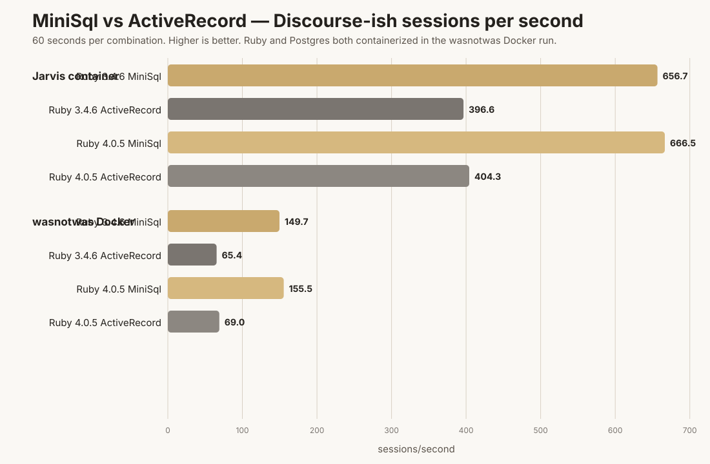

# Ruby data-access benchmark: MiniSql, ActiveRecord, Sequel

A reproducible benchmark for Ruby PostgreSQL data access on a Discourse-ish workload.

Article: https://wasnotwas.com/writing/minisql-activerecord-and-ruby-4-a-small-benchmark-with-a-pulse/

## What it measures

This is **not** a full Rails request benchmark. It compares the query/data-access layer for a forum-style workload:

1. Latest topic list
2. Topic header
3. Post stream
4. User card aggregate
5. Category dashboard aggregate
6. Temporary autosave/event write
7. Temporary readback count

Every query result is iterated and converted into tab-separated text. The benchmark records row counts and rendered byte counts so it measures data access plus lightweight serialization, not just `.length` on an already-materialized array.

The matrix supports:

- Ruby 3.4.6 and Ruby 4.0.5
- YJIT off and on (`RUBYOPT=--yjit`)
- MiniSql
- ActiveRecord
- Sequel

## Important: static database per benchmark run

The benchmark runners follow this lifecycle by default:

1. create a fresh benchmark database
2. populate it once with deterministic synthetic data and indexes
3. run the full Ruby × YJIT × library matrix against that same database
4. drop/remove the database when finished

This avoids comparing runs that accidentally used different fixtures.

Use `KEEP_DB=1` if you want to inspect the generated database after the run. Use `USE_EXISTING_DB=1` only when you deliberately want to benchmark a pre-existing database.

## Local one-command run

This creates a temporary local PostgreSQL database, populates it, runs the full matrix, then drops it:

```bash
mise install ruby@3.4.6 ruby@4.0.5
BENCH_SECONDS=60 ./run-local.sh | tee local-bench-output.txt
```

Tune fixture size:

```bash
USERS=10000 CATEGORIES=48 TOPICS=100000 AVG_POSTS=8 \
  BENCH_SECONDS=60 ./run-local.sh
```

Keep the generated DB:

```bash
KEEP_DB=1 PGDATABASE=minisql_ar_bench BENCH_SECONDS=60 ./run-local.sh
```

Use an existing DB intentionally:

```bash
USE_EXISTING_DB=1 PGDATABASE=my_existing_bench_db BENCH_SECONDS=60 ./run-local.sh
```

## Docker one-command run

This creates a `postgres:16` container, populates it once, runs the full Docker Ruby matrix against that container, then removes the container and network:

```bash
USERS=5000 CATEGORIES=32 TOPICS=50000 AVG_POSTS=6 \
  BENCH_SECONDS=60 ./run-docker.sh | tee docker-bench-output.txt
```

Keep the generated Postgres container:

```bash
KEEP_DB=1 BENCH_SECONDS=60 ./run-docker.sh
```

Use an existing Docker/Postgres database intentionally:

```bash
USE_EXISTING_DB=1 PGDATABASE=ruby_data_bench PGUSER=agent PGHOST=bench-pg \
  BENCH_SECONDS=60 ./run-docker.sh
```

Cleanup if kept:

```bash
docker rm -f bench-pg
docker network rm bench-net
```

## Manual database setup

`setup-db.rb` is the fixture generator used by the runners. It creates a synthetic Discourse-like dataset with the tables and indexes the benchmark expects.

Default dataset:

- 5,000 users
- 32 categories
- 50,000 topics
- roughly 300,000 posts (`AVG_POSTS=6`)
- indexes for the benchmark queries

Manual use:

```bash
createdb minisql_ar_bench
mise x ruby@3.4.6 -- gem install pg --no-document
PGDATABASE=minisql_ar_bench PGUSER=$USER ruby setup-db.rb
```

## Index coverage

`setup-db.rb` creates the indexes used by the point-lookups and ordered hot-path queries:

| Workload step | Index/plan shape |
|---|---|
| latest page | `index_topics_on_category_public` for `(category_id, bumped_at desc)`, then primary-key lookups for joined users/categories |
| topic header | `topics_pkey`, then primary-key joins |
| post stream | `index_posts_on_topic_id_post_number` for `(topic_id, post_number)` |
| user card | `users_pkey` plus `index_posts_on_user_id_created_at` |
| temp readback | `index_bench_events_on_user_id` once the write table has real cardinality |

Representative `EXPLAIN (ANALYZE, BUFFERS)` checks on the default fixture confirmed those plans. The one deliberate exception is `category_counts`: it aggregates topic counts across all categories, so PostgreSQL sensibly scans the visible/non-deleted topic slice and hashes/group-aggregates it. That is intended to represent a dashboard/reporting aggregate, not an accidental missing index.

## Requirements

- PostgreSQL client tools for local runs (`createdb`, `dropdb`)
- Docker for Docker runs
- Ruby 3.4.6 and/or Ruby 4.0.5
- YJIT-capable Ruby builds for `--yjit` runs
- Gems: `mini_sql`, `pg`, `activerecord`, `sequel`

The published runs used:

- `mini_sql 1.6.0`
- `activerecord 8.1.3`
- `sequel 5.104.0`
- `pg 1.6.3`
- 60 seconds per Ruby/layer/YJIT combination

## Results

Published results are in:

- `results.csv`
- `results.json`



The checked-in chart/results reflect the complete MiniSql vs Sequel vs ActiveRecord matrix for Ruby 3.4.6 and Ruby 4.0.5, with YJIT off and on.

## Caveats

- Not a full Rails request benchmark.
- The Docker run in the article was on a 1GB wasnotwas.com droplet; absolute throughput is not comparable to a proper benchmark host.
- The dataset is synthetic. Use your production-like data before drawing production conclusions.
- ActiveRecord buys model semantics. MiniSql and Sequel are more direct when the query is the point.
